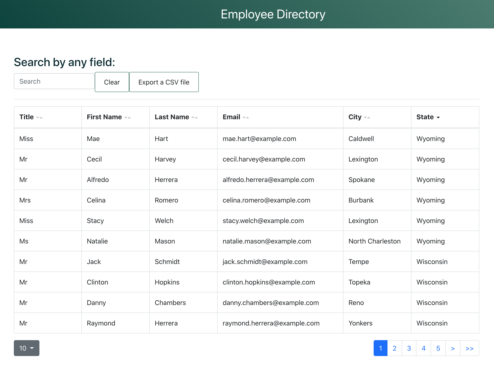

# Employee Directory

Check out the employee directory [here.](https://wilks-employee-directory.herokuapp.com/)

It pulls employee data from an API and allows you to sort and search through that data.

## Table of Contents

- [Installation](#Installation)
- [Testing](#Testing)
- [License](#License)

## Installation

Fork this repo and clone it to your local machine. Run an npm install to download all the necessary dependencies. Open the file directory in your terminal and run `npm start`

## Testing

Run `npm test` to test!

## License

MIT
